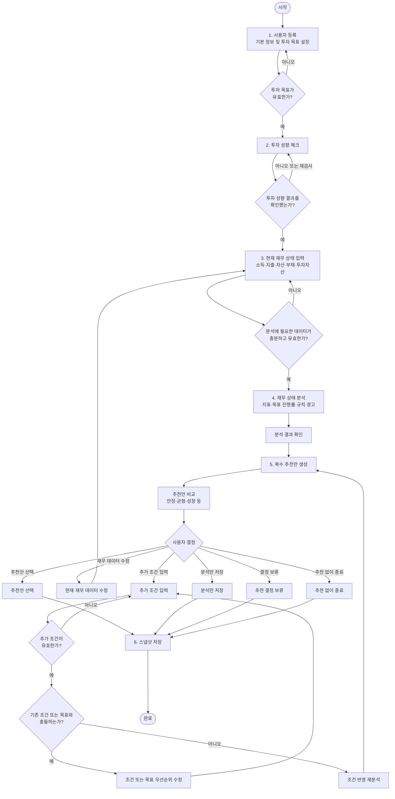
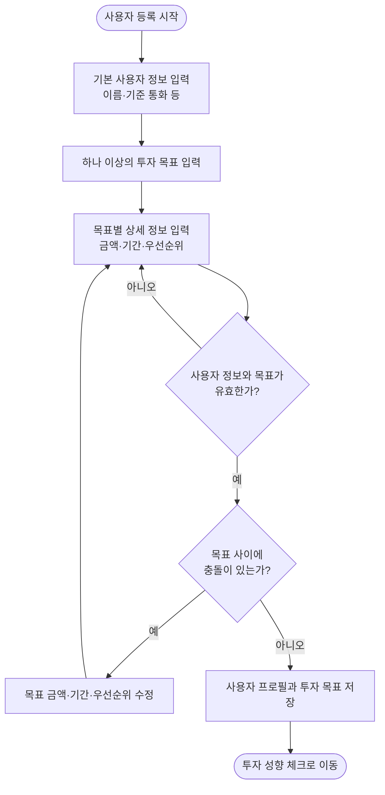
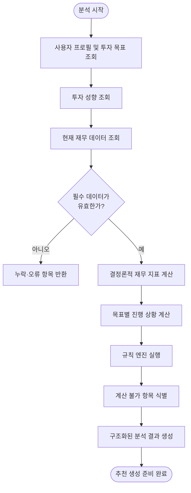
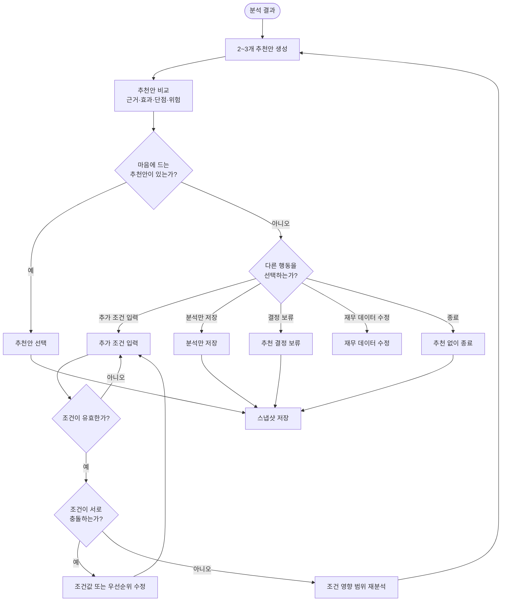
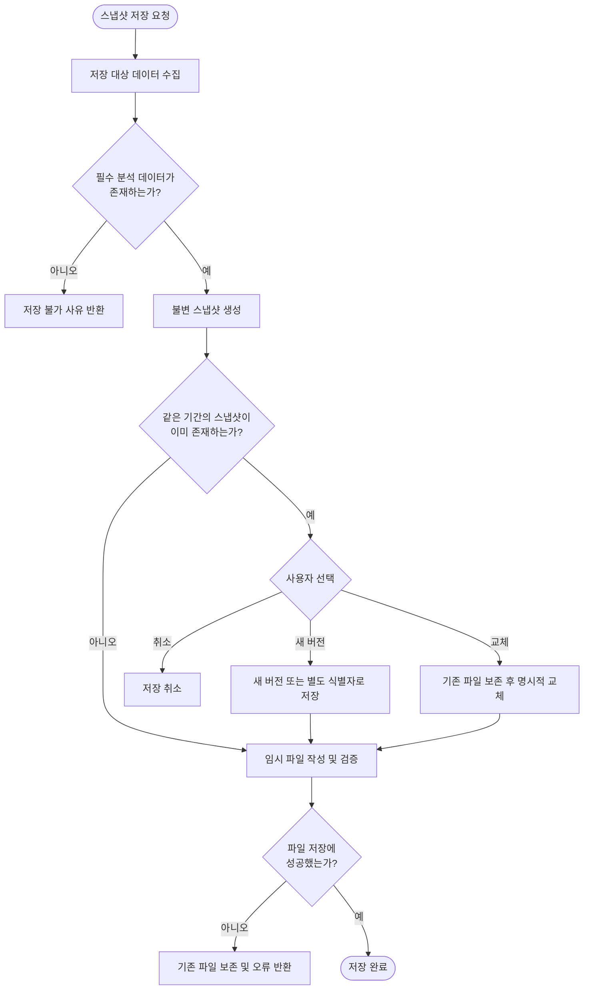
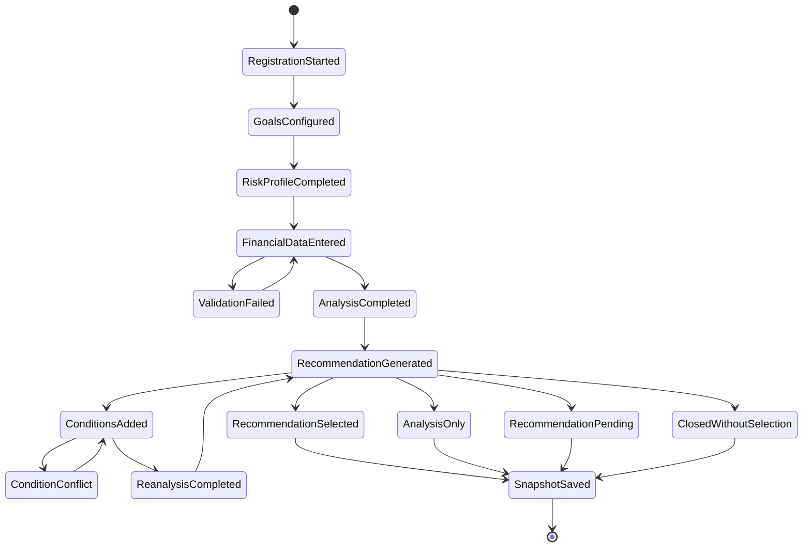
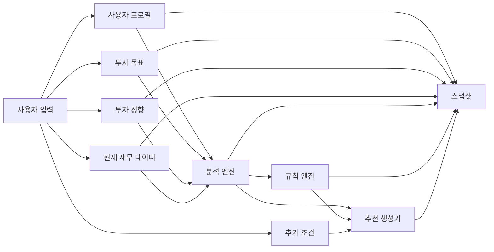

# Personal Finance Copilot Flow Chart

## 1. 문서 목적

이 문서는 Personal Finance Copilot의 핵심 사용자 흐름을 Mermaid 형식으로 표현한다.

각 단계의 상세 입력, 처리, 출력과 예외 조건은 `01-USER-FLOW.md`에서 정의한다.

---

## 2. 전체 사용자 흐름

---

## 3. 사용자 등록 및 투자 목표 흐름

---

## 4. 재무 분석 흐름

---

## 5. 추천 및 재분석 반복 흐름

---

## 6. 스냅샷 저장 흐름

---

## 7. 사용자 상태 다이어그램

---

## 8. 주요 데이터 흐름

